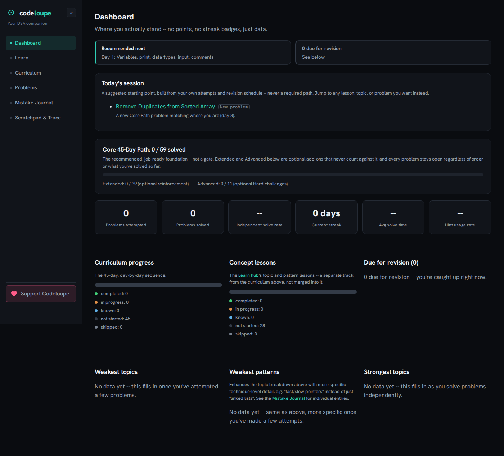
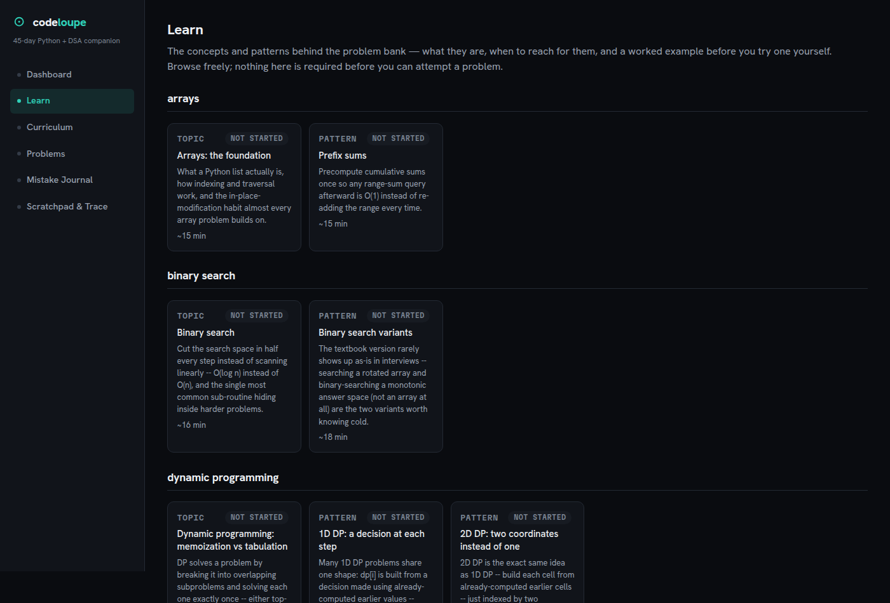
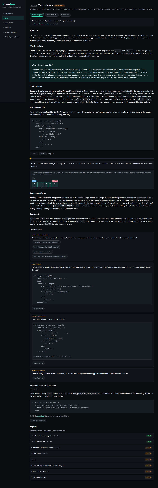
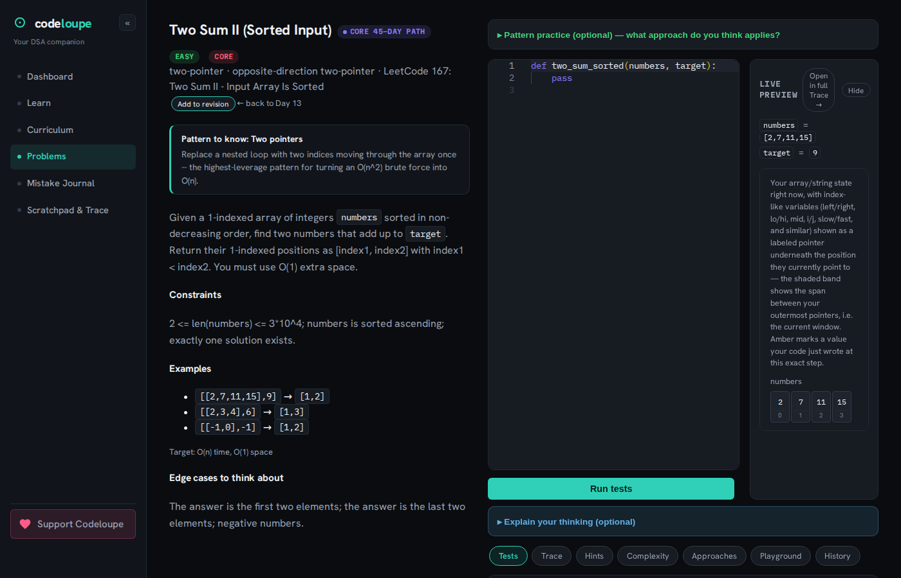
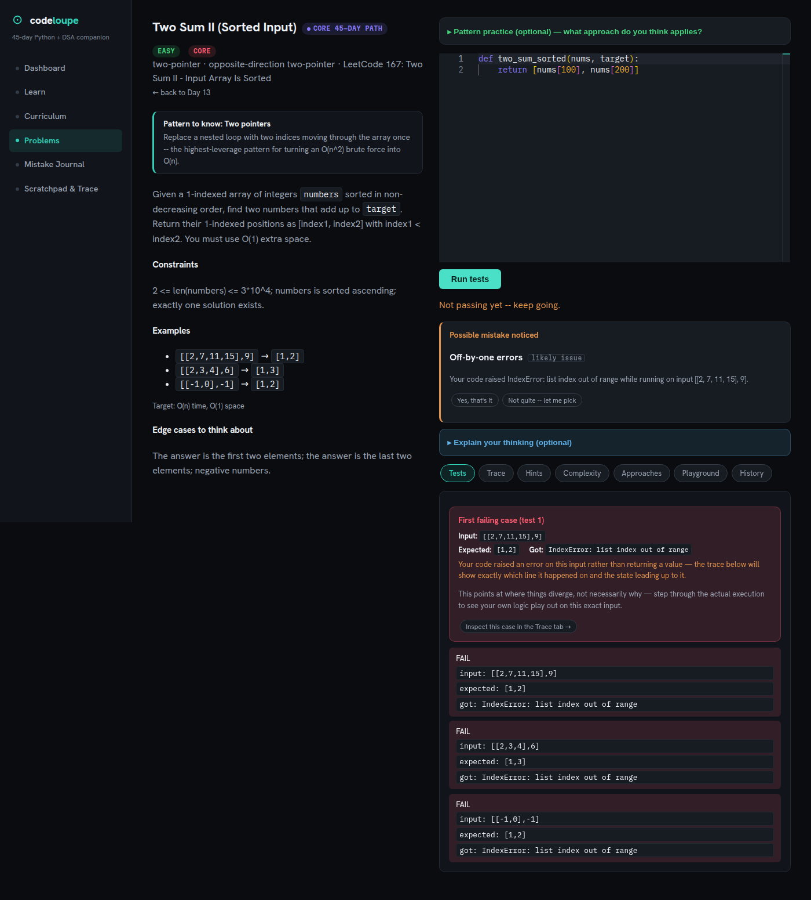
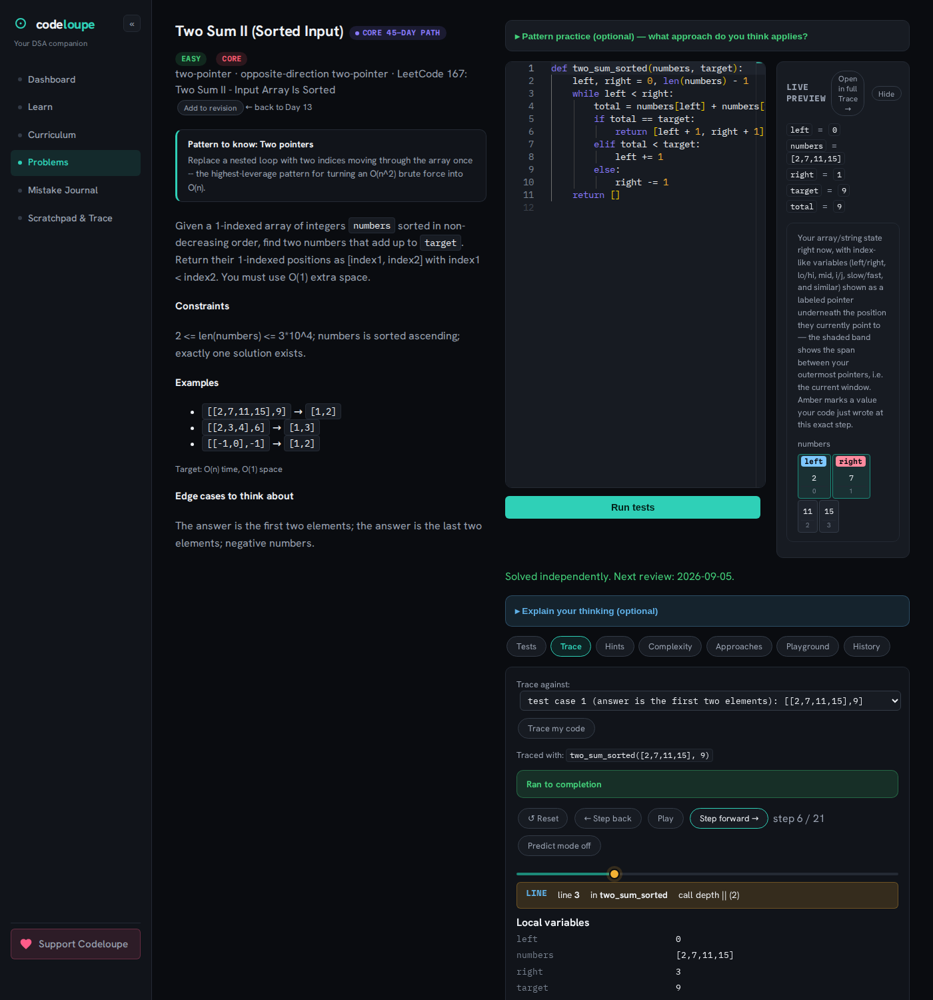
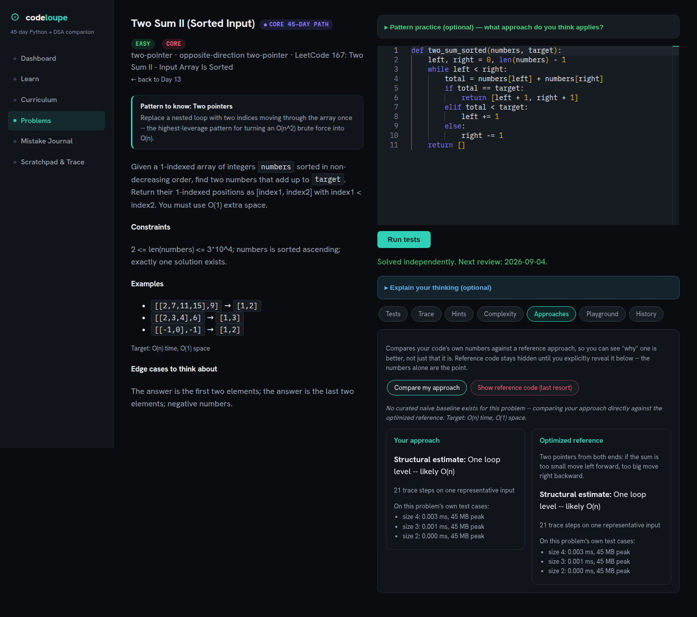
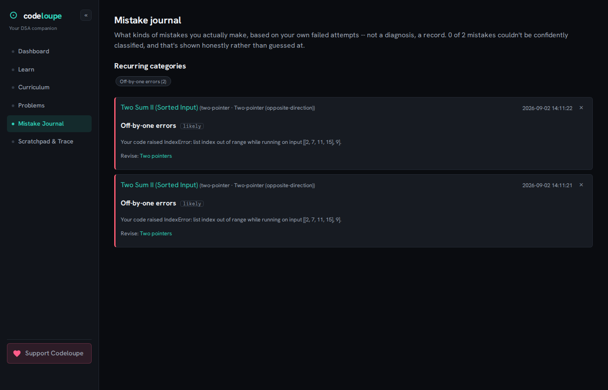
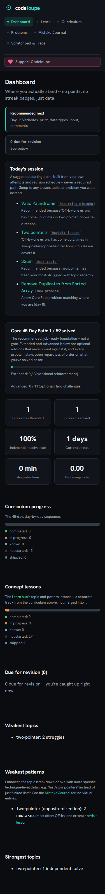

# Codeloupe

Codeloupe is a DSA learning environment built around one idea: you don't understand an algorithm until you've watched *your own broken version of it* run. Most interview-prep tools either teach concepts in the abstract or grade your code as pass/fail and stop there. Codeloupe closes the loop that's usually missing:

**Learn a concept → write your own code → run it → understand why it failed → trace what your actual code did, line by line → see it visualized → review your mistakes later → revise.**

A full 45-day Python + DSA curriculum, 109 curated interview-style problems, 28 concept lessons, and a code tracer built on `sys.settrace` that traces the code *you* submitted — bugs and all — sit behind that loop.

<p align="center">
  
</p>

## Why it's different

Most learning platforms fall into one of two camps: static content (videos, articles, no code) or a plain judge (submit code, get pass/fail, no explanation). Codeloupe tries to be the thing in between:

- **A full curriculum, not a problem dump.** 45 days, Core/Extended/Advanced tiers, prerequisite tracking, and 28 concept lessons that teach *why* a pattern works before you're asked to apply it.
- **Traces your actual code, not a canned animation.** The trace visualizer runs *your* submitted solution under `sys.settrace` and replays its real execution — including when it's wrong. Most "algorithm visualizers" animate a known-correct reference implementation; Codeloupe's traces the thing you actually wrote, so a bug shows up as a bug in the visualization too, not as a generic failure message.
- **Topic-specific visualizations, not one generic view.** Arrays get pointer/window views, linked lists and trees get node-graph views, graphs get grid or adjacency views, heaps get tree-heap views, DP problems get table views with cell-level diff highlighting — the same rendering components are reused for both the curated concept-lesson walkthroughs and real trace output, so the visual language stays consistent everywhere in the app.
- **A Mistake Journal that's honest about uncertainty.** Failed attempts are classified into a fixed set of DSA mistake categories (off-by-one, wrong base case, missed edge case, etc.), but the classifier never claims more confidence than it has — an automatic guess is always labeled "likely," never presented as fact, and a recurring pattern of mistakes links back to the concept lesson that covers it.
- **Adaptive, explainable "Today's session."** A small recommender surfaces a due revision, a problem tied to a recurring mistake, an occasional lesson revisit, and a new problem — every suggestion carries a plain-language reason, nothing is ever gated behind it, and you can navigate anywhere regardless.
- **Approach comparison and complexity analysis**, so you can see *why* one approach beats another on your own problem's inputs, not just that it does.

## The full workflow

<p align="center">
  
</p>

**1. Learn** — Browse the Learn hub (28 concept lessons across every topic in the curriculum), then open one: read what it is, why it matters, how to recognize it, and a step-by-through worked example, answer inline checkpoints, try a practice exercise.

<p align="center">
  
</p>

**2. Practice → Solve** — Open a related problem, write your own solution in the Monaco editor, run it against real test cases.

<p align="center">
  
</p>

**3. Understand failures** — A wrong answer shows exactly which test case failed, with expected vs. actual; a runtime exception is caught and explained, not just dumped as a stack trace.

<p align="center">
  
</p>

**4. Trace your actual code** — Step forward/back or scrub through every line your submission executed, with live local variables and a specialized visualization (array pointers, tree, graph, heap, or DP table) built from that exact execution state.

<p align="center">
  
</p>

**5. Compare approaches** — See your code's own structural/complexity estimate next to a curated baseline and an optimized reference, so you understand *why* one approach is better, not just that it is.

<p align="center">
  
</p>

**6. Review mistakes → Revise** — The Mistake Journal shows what kinds of mistakes actually recur, with a direct link back to the lesson that covers each one, and a spaced revision schedule brings problems back when they're due.

<p align="center">
  
</p>

## Tech stack

- **Backend:** Python 3.11, Flask, SQLite (via the standard library `sqlite3` — no ORM). No paid or external API dependency of any kind.
- **Frontend:** React 19, Vite 5, React Router (HashRouter, so deep links work with zero server-side routing config), Monaco Editor bundled locally (not loaded from a CDN — see `frontend/src/monacoSetup.js`).
- **Code execution:** a sandboxed subprocess (timeout + memory/CPU limits) for running submissions, and a separate `sys.settrace`-based tracer for step-by-step execution traces.
- **Testing:** 7 Playwright end-to-end suites (frontend, 207+ checks) plus backend endpoint/live-verification scripts, all runnable with one script (`run_all_tests.sh`).

## Architecture

See [`docs/architecture.md`](docs/architecture.md) for the full breakdown — system overview, the trace generation pipeline, the visualizer adapter pattern, mistake classification, and the recommendation logic — including an honest discussion of what the trace-your-own-code system can and can't do.

## Features

- 45-day curriculum (Core/Extended/Advanced problem tiers, prerequisite tracking, resume/recommended-next)
- 28 concept lessons (what/why/recognize/intuition, an interactive worked-example walkthrough, inline checkpoints, a practice exercise) across every topic the curriculum covers
- 109 curated, interview-style problems with visible test cases, edge-case notes, and constraints
- A Monaco-based code editor with a real Python sandbox behind "Run tests"
- Step-by-step execution tracing of your own submitted code (correct or buggy), including a predict-mode
- Topic-specific visualizations: array/pointer, linked list, tree, heap, grid graph, node graph, and DP table views
- A 3-rung progressive hint system
- Approach comparison against curated baselines/optimized references, with structural complexity estimates
- A Mistake Journal: honest confidence-tagged classification, recurring-category tracking, and links back to relevant lessons
- Spaced revision scheduling for problems due for review
- An adaptive, fully-explained "Today's session" recommender (revision, recurring mistake, occasional lesson revisit, weak pattern/topic, new problem) — always explainable, never a required path
- A dashboard tracking curriculum progress, concept-lesson progress (tracked separately, since they're two different tracks), solve rate, streak, and topic/pattern-level strengths and weaknesses

## Running it locally

Requires **Python 3.11+** and **Node 18+**. No environment variables or API keys are required to run the app — everything (including `PORT`/`FLASK_DEBUG`/`VITE_API_BASE`/`CORS_ORIGINS`) has a working default. Those four only matter for a non-default setup, e.g. deploying the frontend and backend on separate hosts — see `docs/architecture.md`'s "Deployment" section.

**1. Clone and set up the backend:**
```bash
git clone <this-repo-url> codeloupe
cd codeloupe/backend
pip install -r requirements.txt
python3 db/init_db.py     # creates and seeds backend/db/traceviz.db
python3 app.py            # starts on http://127.0.0.1:5001
```

**2. Set up the frontend** (in a second terminal):
```bash
cd codeloupe/frontend
npm install
npm run dev                # starts on http://127.0.0.1:5173
```

Open `http://127.0.0.1:5173` — you should land on the Dashboard.

**Windows convenience scripts:** after the one-time setup above (steps 1 and 2, done once), `start.bat` in the repo root is all you need for every subsequent start — double-click it. It starts both servers each in their own minimized window (out of your way in the taskbar, not full windows on your screen), waits until the frontend is actually responding before doing anything else, then opens `http://localhost:5173/` in your browser automatically. It checks that dependencies and the database are already in place and prints a clear message — not a silent failure — if something's missing or a server doesn't start; if a server fails, open its minimized window from the taskbar to see the real error. Run `stop.bat` when you're done for the day, since the servers keep running until you do. Both are plain batch files (no PowerShell) using the same `start`/`taskkill` primitives Windows batch scripts have always used, on purpose — an earlier version tried to hide the windows entirely via PowerShell and failed unpredictably on some real-world setups, so this trades a small amount of polish for something that actually works.

**3. Run the tests** (optional, needs both servers above already running):
```bash
cd codeloupe/backend
pip install -r requirements-dev.txt   # adds requests + playwright, dev/test only
playwright install chromium           # one-time browser download for the e2e suites
cd ..
./run_all_tests.sh
```

**4. Production build:**
```bash
cd codeloupe/frontend
npm run build     # outputs static assets to frontend/dist/
```

The build is a static site with no server-side rendering; see `docs/architecture.md`'s "Deployment" section for how to serve it alongside the backend API.

<p align="center">
  
</p>

## Documentation

- [`docs/architecture.md`](docs/architecture.md) — system architecture, trace pipeline, visualizer design, deployment
- [`docs/decisions.md`](docs/decisions.md) — the honest log of every scope/architecture decision and why it was made
- [`docs/45-day-curriculum.md`](docs/45-day-curriculum.md) — the full day-by-day curriculum
- [`docs/learning-philosophy.md`](docs/learning-philosophy.md) — the pedagogical rules the content follows
- [`docs/problem-roadmap.md`](docs/problem-roadmap.md) — the curated problem set's structure and coverage

## Known limitations

The execution sandbox is appropriate for trusted, single-user code — it is not hardened against hostile input. The complexity estimator is a structural teaching aid (loop nesting, recursion shape), not a certified Big-O prover. The trace visualizer's topic-specific renderers cover the data shapes the curriculum actually uses (arrays, linked lists, trees, graphs, heaps, DP tables) rather than arbitrary Python objects. The problem bank is curated and intentionally not exhaustive. See `docs/decisions.md` for the full, unfiltered list of scope decisions and why each one was made.

## License

[MIT](LICENSE) — see the `LICENSE` file.
